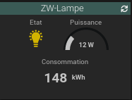
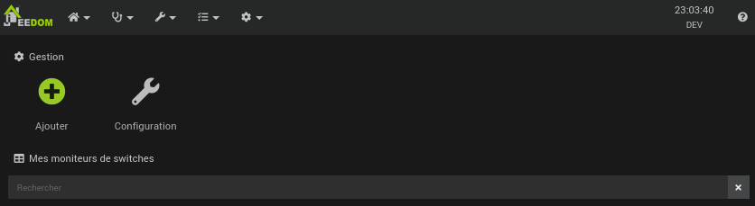
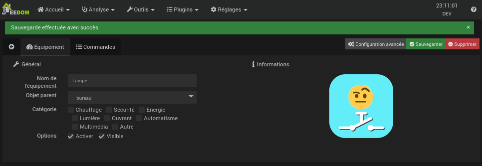
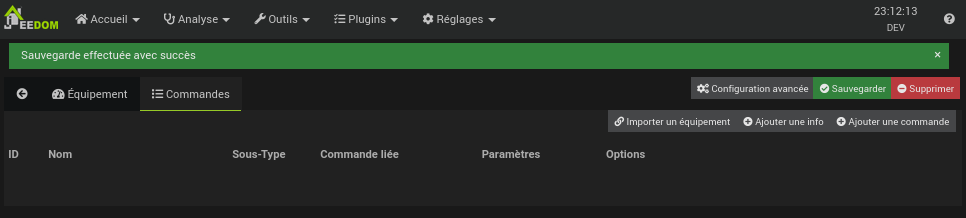
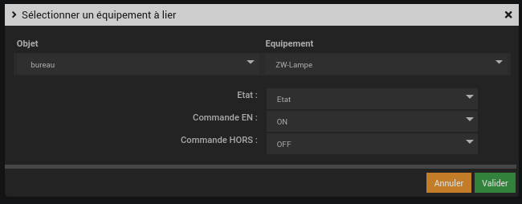
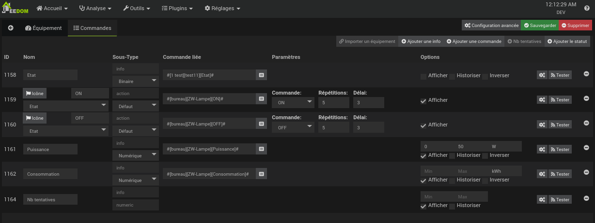
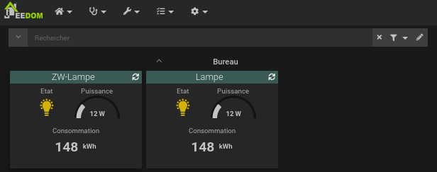

#  Plugin "Switch Assistant" pour Jeedom
Le plugin **swassit** permet de donner un ordre d'enclenchement ou de déclenchemenet à un équipement. L'ordre sera ensuite automatiquement répété jusqu'à ce que l'on aie un retour confirmant que l'ordre a bien été exécuté.

# Configuration du plugin
Le plugin ne nécessite aucune configuration, il faut juste l’activer.

# Création d'un équipement
Il est possible de créer et configurer un équipement soi-même mais le plus simple est de créer un équipement "vide" puis de le lier à l'équipement qui sera assisté.

## Création automatique
Dans cet exemple, nous allons assister le fonctionnement d'un équipement nommé \[bureau\]\[ZW-lampe\] qui a les actions et infos suivantes:

+ **ON**: Action pour allumer la lampe.
+ **OFF**: Action pour eteindre la lampe.
+ **Allumé**: Info binaire qui indique si la lampe est allumée.
+ **Puissance**: Puissance de la lampe.
+ **Consommation**: Energie consommée par la lampe.

### Création de l'équipement *swassist*
Ouvrir la page de gestion des équipement du plugin *swassist* et cliquer sur le bouton **ajouter**

+ Saisir le nom de l'équipement
+ Sélectionner
+ Rendre l'équipement visible
+ Activer l'équipement
+ Sauvegarder

### import de l'équipement à assister

+ Sélectionner le panneau **Commandes**

+ Cliquer sur **Importer un équipement**
+ Sélection
    + l'équipement à importer
    + La commande qui indique l'état de switch
    + La commande d'enclenchement
    + La commande de déclenchment 

+ Cliquer sur *valider*
+ Resélectionner le panneau *Comandes* pour voir les commandes importées

On voit que:
* Une commande liée a été créée pour chaque commande de l'équipement assisté.
* La commande 1103 est la commande d'enclechement.
* La commande 1104 est la commande de déclenchement.
* Etat est l'info de retour pour les commande d'enclenchement et de déclenchement.
* Les comandes d'enclencement et de déclenchement seront répétée au maximum 5 fois toutes les 3 secondes.
* La valeur des options des commandes ont été reprises des comandes liées.

### L'équipement créé dans le dashboard

On voit dans le dashboard que les définition des widgets ont été reprises de l'équipement assisté.

Un click sur l'icon de l'ampoule de l'équipement swassist provoquera l'extinction ou l'allumage de l'équipement assisté. On peut donc rendre l'équipement assisté invisible et l'on utilisera uniquement l'équipement swassist et ses commandes pourront également être utilisées dans les alertes et scénarios à la place des commandes de l'équipement assisté.
