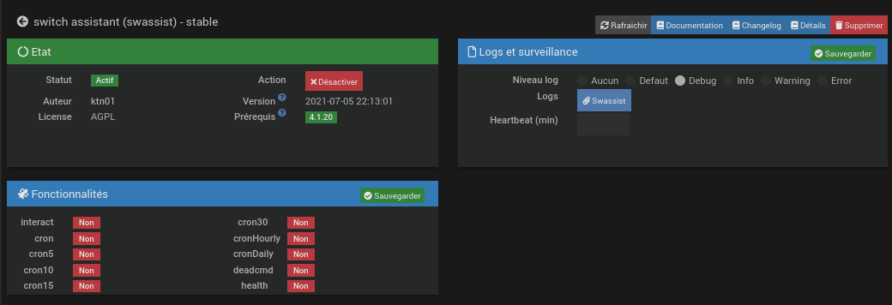

#  Plugin "Switch Assistant" pour Jeedom
Le plugin **swassit** permet de donner un ordre d'enclenchement ou de déclenchemenet à un équipement. L'ordre sera ensuite automatiquement répété jusqu'à ce que l'on aie un retour confirmant que l'ordre a bien été exécuté.

# Configuration du plugin
Le plugin ne nécessite aucune configuration, il faut juste l’activer.

# Création d'un équipement
Il est possible de créé et configurer un équipement soi-même mais le plus simple est de créer en équipement "vide" puis de de lier à l'équipement qui sera comandé via notre équipement swassist.

## Création automatique

Dans cet exemple, nous allons assister le fonctionnement d'un équipement nommé \[bureau\]\[ZW-lampe\] qui a les actions et infos suivantes:

+ **ON**: Action pour allumer la lampe.
+ **OFF**: Action pour eteindre la lampe.
+ **Allumé**: Info binaire qui indique si la lampe est allumée.
+ **Puissance**: Puissance de la lampe.
+ **Consommation**: Energie consommée par la lampe.
